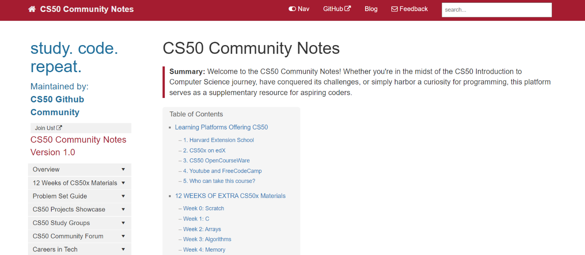

<h1 align="center">
<a href="https://melissadeleonx.github.io/cs50-community-notes/" target="_blank">CS50 Community Notes</a>
</h1>

<p align="center">
  Welcome to the <a href="https://github.com/melissadeleonx/cs50-community-notes/" target="_blank"><strong>CS50 Community Notes</strong></a> repository! This repository is a collaborative effort to compile and share notes related to CS50, the Introductory Computer Science course offered by <a href="https://cs50.harvard.edu/x/2024/" target="_blank"><strong>Harvard University.</strong></a>
</p>

<p align="center">
  <a href="https://choosealicense.com/licenses/mit/">
    
  </a>
  
</p>



<p align="center">
  <a href="https://twitter.com/melissadeleonx">
    
  </a>
  <a href="https://tech-journey-melissadeleonx.vercel.app/">
    
  </a>
</p>

## Table of Contents

- [About CS50 Community Notes](#about-cs50-community-notes)
- [Getting Started](#getting-started)
- [Contributing](#contributing)
- [Code of Conduct](#code-of-conduct)
- [License](#license)

## About CS50 Community Notes

CS50 Community Notes is a collection of notes, tips, and resources related to the CS50 course. Whether you're a student looking for additional explanations, a tutor preparing materials, or anyone interested in computer science concepts covered in CS50, this repository aims to be a valuable resource.

### Technologies Used

CS50 Community Notes is built using the following technologies:

- HTML
- CSS
- Markdown
- YAML (YML)
- Bootstrap
- JavaScript

### Contributors

- Built by: **[Melissa De Leon](https://github.com/melissadeleonx)**
- Updated and maintained by: **[GitHub CS50 Community](https://github.com)**

### Attribution

- Primary Source: [Harvard University CS50](https://cs50.harvard.edu/)
- The website is built using [Jekyll](https://jekyllrb.com/)
- Deployed on [GitHub](https://melissadeleonx.github.io/cs50-community-notes/)
- Employs the [Documentation Jekyll theme](https://idratherbewriting.com/documentation-theme-jekyll/)

## Getting Started

To get started with CS50 Community Notes, follow these steps:
1. **Clone the Repository:**
   ```bash
   git clone https://github.com/melissadeleonx/cs50-community-notes.git

2 **Navigate to the Repository:**

```html
<div style="width: 100%; height: 300px;" id="lottie-container"></div>
<script src="https://cdnjs.cloudflare.com/ajax/libs/bodymovin/5.7.1/lottie.js"></script>
<script>
  // Replace the URL with your Lottie animation URL
  var animationData = "https://lottie.host/e392d49a-5c15-43a9-a83d-9148e1159b6b/KLEcCMdGVv.json";
  
  // Set up the Lottie player
  var anim = lottie.loadAnimation({
    container: document.getElementById('lottie-container'),
    renderer: 'svg',
    loop: true,
    autoplay: true,
    animationData: animationData
  });
</script>