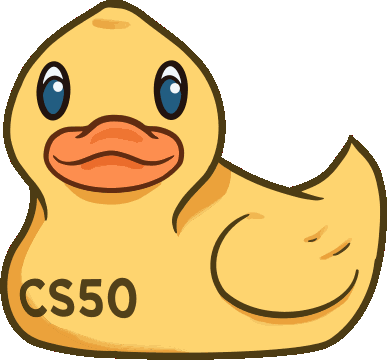

<!-- Added some personal touch, feel free to update -->

  <h1 style="font-size: 3em; font-weight: bold; background: linear-gradient(to right, violet, indigo, blue, green, yellow, orange, red); -webkit-background-clip: text; background-clip: text; color: transparent; background-size: 200% 200%; animation: rainbowShine 8s linear infinite;">
    Welcome Fellow Learners! 
  </h1>



## Learning Platforms Offering CS50

CS50, Harvard University's introductory computer science course, is acclaimed for its thorough instruction in fundamental Computer Science and Programming concepts. The course focuses on cultivating computational thinking, abstraction, algorithms, and data structures, equipping students with robust problem-solving skills. Explore the following platforms to access CS50 lectures or enroll in the course:

### 1. Harvard Extension School

Many Harvard Extension courses like **CS50 (aka CSCI E-50)** are open enrollment, but students must fulfill certain requirements, such as placement tests, in order to register. For those seeking credit-bearing options and a more formalized learning experience, explore **[Harvard Extension School](https://cs50.harvard.edu/extension/2024/spring/syllabus/){:target="_blank"}**. Visit their official website to find detailed information on enrollment procedures, tuition fees, and potential academic credits associated with CS50.

### 2. CS50x on edX

**[edX](https://www.edx.org/learn/computer-science/harvard-university-cs50-s-introduction-to-computer-science){:target="_blank"}** stands out as a leading online learning platform, co-founded by Harvard University and MIT. This platform collaborates with institutions worldwide to provide a diverse array of courses, including the renowned CS50, Harvard University's introductory computer science course.

CS50 is readily accessible on edX for free, allowing learners to audit the course. This grants access to lectures, problem sets, and other materials without any financial commitment.

For those seeking formal recognition, enrolling in CS50 for a verified certificate is an option, albeit with associated fees. This certificate serves as a valuable credential, attesting to the learner's completion and proficiency in the course.

{% include note.html content="edX demonstrates a commitment to accessibility by offering up to a 90% discount on verified certificates for learners facing financial constraints. Financial assistance is available in most courses that provide verified certificates." %}

### 3. CS50 OpenCourseWare

**[CS50 OpenCourseWare](https://cs50.harvard.edu/x/2024/){:target="_blank"}** can be freely accessed without formal registration through edX. However, for a more enriched experience, including progress tracking and official course participation, free registration on edX is recommended. Here's how to make the most of your CS50 OpenCourseWare experience:

1. Access Without Registration: Explore CS50 OpenCourseWare directly for free, allowing you to peruse course materials and delve into the content without the need for formal registration.

2. Enhanced Experience with edX: To officially join the course, monitor your progress, and participate in the CS50 community, register for free on edX. This step ensures a comprehensive learning experience with additional features.

3. Connect to GitHub: For an optimized coding experience, connect your CS50x account to GitHub. This connection facilitates activities in the Codespace, where coding assignments are executed seamlessly.

4. Visit Your CS50x Account: Once registered on edX, visit your personalized CS50x account at **[cs50.me/cs50x](cs50.me/cs50x){:target="_blank"}** to access resources, submit assignments, and monitor your progress throughout the course.



### 4. Youtube and FreeCodeCamp

CS50's **[YouTube channel](https://www.youtube.com/playlist?list=PLhQjrBD2T380F_inVRXMIHCqLaNUd7bN4){:target="_blank"}** offers a wealth of resources, there are a variety of content such as lectures, shorts, and sections. This platform provides the flexibility to learn at your own pace, allowing you to engage with the material on a familiar video-sharing platform. CS50's YouTube presence extends the reach of the course to a broader audience, making learning accessible to those who prefer the visual and dynamic nature of video content.

Additionally, FreeCodeCamp hosts a **[26-hour video of the CS50 course](https://www.youtube.com/watch?v=LfaMVlDaQ24){:target="_blank"}** , providing an alternative avenue for in-depth learning. This extensive video resource on FreeCodeCamp offers a comprehensive experience, allowing learners to immerse themselves in the course content over an extended period.

### 5. Who can take this course?

**ANYONE. ANYWHERE.** CS50 courses are free for all. But please note that it is well-suited for learners aged 12 and above. Younger learners may require assistance from a parent, and local laws may impact their access to certain services associated with the course.

No formal prerequisites are required, but it is highly recommended to review the courses offered to ensure it aligns with your current level of knowledge and learning goals.

## 11 WEEKS OF EXTRA CS50x Materials
While the official CS50 website offers a notes section, the CS50 Community Notes serve as a unique compilation of insights derived from video lectures, sections, shorts, and contributions from both current and past students. These supplementary notes are meticulously curated to aid fellow learners on their educational journey. The course's subject matter is organized over 11 weeks, each section subtitled in accordance with the context in which its topics are introduced.

### Week 0: Scratch
- Computer Science Fundamentals
- Computational Thinking
- Problem Solving: Inputs, Outputs
- Representation: Unary, Binary, Decimal, ASCII, Unicode, RGB
- Abstraction, Algorithms
- Running Times, Pseudocode
- Scratch: Functions, Variables, Boolean Expressions, Conditionals, Loops, Events, Threads

### Week 1: C
- C Language Basics
- Source Code, Machine Code, Compiler
- Correctness, Design, Style
- Visual Studio Code
- Syntax Highlighting, Escape Sequences
- Header Files, Libraries, Manual Pages
- Types, Conditionals, Variables, Loops
- Linux, Graphical User Interface (GUI), Command-Line Interface (CLI)
- Constants, Comments, Pseudocode
- Operators, Integer Overflow, Floating-Point Imprecision

### Week 2: Arrays
- Preprocessing, Compiling, Assembling, Linking
- Debugging
- Arrays, Strings
- Command-Line Arguments, Cryptography

### Week 3: Algorithms
- Searching: Linear Search, Binary Search
- Sorting: Bubble Sort, Selection Sort, Merge Sort
- Asymptotic Notation: 𝑂(1), 𝑂(𝑛), 𝑂(log 𝑛), 𝑂(𝑛 log 𝑛)
- Recursion

### Week 4: Memory
- Pointers, Segmentation Faults
- Dynamic Memory Allocation, Stack, Heap
- Buffer Overflow, File I/O, Images

### Week 5: Data Structures
- Abstract Data Types
- Queues, Stacks
- Linked Lists
- Trees, Binary Search Trees
- Hash Tables, Tries

### Week 6: Python
- Python Basics
- Functions, Variables, Boolean Expressions, Conditionals, Loops
- Modules, Packages

### Week 7: SQL
- SQL Basics
- Tables, Types, Statements, Constraints
- Indexes, Keywords, Functions, Transactions
- Race Conditions, SQL Injection Attacks

### Week 8: HTML, CSS, JavaScript
- Internet Basics: Routers, TCP/IP, DNS
- HTTP: URLs, GET, POST
- HTML: Tags, Attributes
- Servers, CSS: Properties, Selectors
- Frameworks, JavaScript: Variables, Conditionals, Loops, Events

### Week 9: Flask
- Flask Basics
- Route, Decorators
- Requests, Responses, Sessions, Cookies

### Week 10: Cybersecurity
- Passwords, Cracking
- Ciphers, Encryption
- Two-Factor Authentication
- Privacy

### Week 11: Artificial Intelligence
- Language Models (LLMs)
- Prompt Engineering, Decision Trees
- Minimax, Machine Learning, Reinforcement
- Generative AI, Transformer Architecture

**Download PDF Version of CS50 Community Notes [here](#).**

## Frequently Asked Questions

For questions related to tracking progress, signing up, or assignment submissions, we recommend checking the official CS50 website's **[FAQ page](https://cs50.harvard.edu/x/2024/faqs/){:target="_blank"}**. The official FAQ page provides comprehensive answers to common queries and ensures accurate and up-to-date information.

Our community is available to assist you with questions and provide additional guidance beyond the official FAQ. Feel free to engage in discussions, seek clarification, or share insights with fellow learners. While we offer valuable community-driven resources, certain inquiries are best addressed through the official channels.

Thank you for being part of our learning community!

## Problem Set Guide

## CS50 Projects Showcase

## CS50 Study Group

## CS50 Community Notes Forum

## Careers in Tech

## Advanced Topics

## Contribute to the Community

